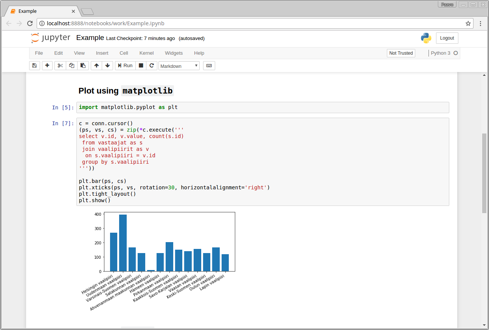

# ylevaalikone2015

Explore the data from YLE Vaalikone 2015.



## Run Jupyter Instance to Explore the Data

Requirements:
- [Wget](https://www.gnu.org/software/wget/)
- [Stack](https://docs.haskellstack.org/en/stable/README/)
- [Docker](https://www.docker.com/)

To build the ETL tool, load the data, and run an instance of Jupyter inside a Docker container, just run the `run.sh` script.
```shell
$ ./run.sh
```

For instructions for the individual steps, look into `run.sh`.


## Maintainer

Paavo Parkkinen <pparkkin@gmail.com>
